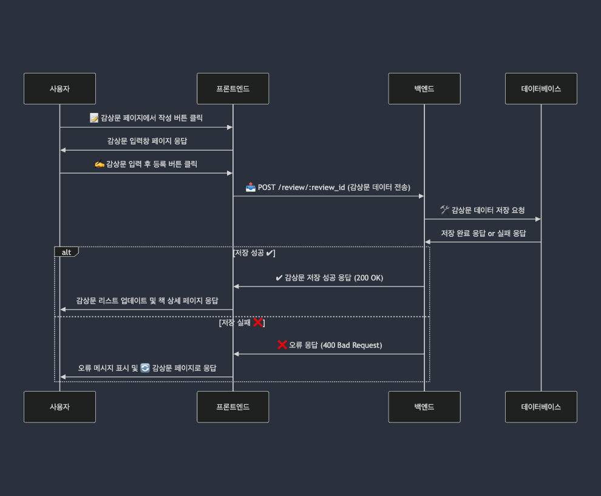

# 도서 리뷰 플랫폼 "북아일랜드 (Book `Is`land)"

> 예시 자료임!!

**북아일랜드 (Book `Is`land)**는 사용자가 자유롭게 도서 리뷰를 작성하고, 다른 사용자와 의견을 공유할 수 있는 플랫폼입니다.

- 프로젝트 기간: 2025년 2월 4일 ~ 2025년 2월 17일
- 주요 기능: **리뷰(감상문) 작성 및 수정, 사용자 인증(로그인/회원가입), 오디오 북, 챗북(챗봇), 북마크**
- 목표: **사용자가 쉽고 직관적으로 도서 리뷰를 작성하고 탐색할 수 있도록 최적화된 UI/UX를 제공하며, 오디오 북, 챗북, 북마크 기능을 통해 몰입형 독서 경험을 지원**

## 사용한 기술 스택 (프론트엔드 기준)

| 분류               | 기술 스택            | 설명                                                    |
| ------------------ | -------------------- | ------------------------------------------------------- |
| **프론트엔드**     | HTML                 | 웹 페이지의 구조를 설계하는 마크업 언어                 |
| **프론트엔드**     | CSS                  | 웹 페이지의 디자인 및 레이아웃을 스타일링               |
| **프론트엔드**     | Nunjucks             | 템플릿 엔진으로, 프론트 서버에서 HTML을 동적으로 렌더링 |
| **API 통신**       | Axios                | HTTP 요청을 보내고 응답을 받는 비동기 API 클라이언트    |
| **인증**           | JWT (JSON Web Token) | 사용자 로그인 인증을 위한 토큰 기반 인증 방식           |
| **인증**           | cookie-parser        | HTTP 요청에서 쿠키를 파싱하여 사용하도록 돕는 미들웨어  |
| **환경 변수 관리** | dotenv               | 환경 변수를 관리                                        |
| **서버**           | Express              | Node.js 기반 웹 서버 프레임워크, API 및 웹 서비스 구축  |

---

## 프론트엔드 팀원 역할 분배(예시)

혜성

| **역할**          | 기능          | 설명                                          |
| ----------------- | ------------- | --------------------------------------------- |
| **UI/UX 설계**    | 기능          | 프로젝트 전체 디자인 설계, 전체 레이아웃 구성 |
| **페이지 개발**   | 기능          | 메인 페이지, 책 페이지, 커뮤니티 페이지       |
| **인터랙션 구현** | 기능          | 로그인 팝업, 슬라이드                         |
| **인증 및 보안**  | **핵심 기능** | JWT 기반 로그인/회원가입 기능 구현            |

유정

| **역할**        | 설명                                             |
| --------------- | ------------------------------------------------ |
| **페이지 개발** | 감상문 페이지, 감상문 상세 페이지, 북마크 페이지 |

---

## 프론트엔드 핵심 기능 및 구현 내용

프론트엔드에서 구현한 주요 기능(예시)

혜성

| 기능명 구현 내용               | 구현 내용                                                              |
| ------------------------------ | ---------------------------------------------------------------------- |
| **도서 검색 기능**             | 사용자가 검색창에 도서명을 입력하면 API 요청을 통해 검색 결과를 보여줌 |
| **사용자 인증 및 로그인 유지** | JWT 토큰을 활용한 로그인 유지 기능 개발                                |

유정

| 기능명 구현 내용       | 구현 내용                                                                   |
| ---------------------- | --------------------------------------------------------------------------- |
| **리뷰 작성 및 수정**  | 사용자가 특정 도서에 대한 리뷰를 작성하고, 필요 시 수정할 수 있도록 UI 제공 |
| **리뷰 리스트 페이지** | 모든 사용자의 리뷰를 리스트 형태로 출력하며, 정렬 및 필터링 기능 추가       |
| **프로필 관리 기능**   | 사용자 프로필 정보(닉네임, 프로필 사진) 수정 기능 제공                      |

## 리뷰 작성 기능 흐름도(유저 플로우 참고) => 이것도 예시임

1. 사용자가 감상문 페이지에서 작성 버튼을 누름
2. 감상문을 입력하고 등록 버튼을 클릭
3. 감상문 데이터가 서버로 전송됨
4. 서버에서 감상문을 저장 후 응답 반환
5. 성공하면 리스트에 추가, 실패하면 오류 표시

---

## 4. 이슈 사항 및 수정 내역

프로젝트 진행 중 발생한 문제 & 해결 방법

| 이슈 사항                       | 원래 설계                           | 발생한 문제                      | 수정 후 반영 내용                                       |
| ------------------------------- | ----------------------------------- | -------------------------------- | ------------------------------------------------------- |
| 도서 검색 API 응답 속도 지연    | 클라이언트에서 입력 시마다 API 요청 | 과도한 요청으로 서버 부하 발생   | Debounce 적용하여 요청 최적화                           |
| JWT 로그인 유지 문제            | 새로고침 시 상태 유지 불가능        | 새로고침 시 인증 상태 초기화됨   | **LocalStorage에 JWT 저장 후 Redux 초기화 시 불러오기** |
| 리뷰 작성 후 즉시 반영되지 않음 | Redux 상태 업데이트 미반영          | 리뷰 작성 후 새로고침해야 반영됨 | 리뷰 작성 후 Redux 상태 업데이트 트리거 추가            |

## 4. 회고록 (프론트엔드 팀원들의 피드백 및 개선 방향)

잘한 점

개선할 점

다음 프로젝트에서 적용할 점
