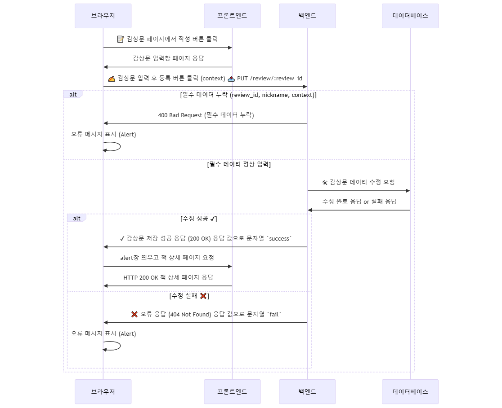

# 도서 리뷰 플랫폼 "북아일랜드 (Book `Is`land)"

> 예시 자료임!!

**북아일랜드 (Book `Is`land)**는 사용자가 자유롭게 도서 리뷰를 작성하고, 다른 사용자와 의견을 공유할 수 있는 플랫폼입니다.

- 프로젝트 기간: 2025년 2월 4일 ~ 2025년 2월 17일
- 주요 기능: **리뷰(감상문) 작성 및 수정, 사용자 인증(로그인/회원가입), 오디오 북, 챗북(챗봇), 북마크**
- 목표: **사용자가 쉽고 직관적으로 도서 리뷰를 작성하고 탐색할 수 있도록 최적화된 UI/UX를 제공하며, 오디오 북, 챗북, 북마크 기능을 통해 몰입형 독서 경험을 지원**

## 사용한 기술 스택 (프론트엔드 기준)

| 분류               | 기술 스택            | 설명                                                    |
| ------------------ | -------------------- | ------------------------------------------------------- |
| **프론트엔드**     | HTML                 | 웹 페이지의 구조를 설계하는 마크업 언어                 |
| **프론트엔드**     | CSS                  | 웹 페이지의 디자인 및 레이아웃을 스타일링               |
| **프론트엔드**     | Nunjucks             | 템플릿 엔진으로, 프론트 서버에서 HTML을 동적으로 렌더링 |
| **API 통신**       | Axios                | HTTP 요청을 보내고 응답을 받는 비동기 API 클라이언트    |
| **인증**           | JWT (JSON Web Token) | 사용자 로그인 인증을 위한 토큰 기반 인증 방식           |
| **인증**           | cookie-parser        | HTTP 요청에서 쿠키를 파싱하여 사용하도록 돕는 미들웨어  |
| **환경 변수 관리** | dotenv               | 환경 변수를 관리                                        |
| **서버**           | Express              | Node.js 기반 웹 서버 프레임워크, API 및 웹 서비스 구축  |

---

## 프론트엔드 팀원 역할 분배(예시)

혜성

| **역할**          | 기능          | 설명                                          |
| ----------------- | ------------- | --------------------------------------------- |
| **UI/UX 설계**    | 기능          | 프로젝트 전체 디자인 설계, 전체 레이아웃 구성 |
| **페이지 개발**   | 기능          | 메인 페이지, 책 페이지, 커뮤니티 페이지       |
| **인터랙션 구현** | 기능          | 로그인 팝업, 슬라이드                         |
| **인증 및 보안**  | **핵심 기능** | JWT 기반 로그인/회원가입 기능 구현            |

유정

| **역할**        | 설명                                             |
| --------------- | ------------------------------------------------ |
| **페이지 개발** | 감상문 페이지, 감상문 상세 페이지, 북마크 페이지 |

---

## 프론트엔드 핵심 기능 및 구현 내용

프론트엔드에서 구현한 주요 기능(예시)

혜성

| 기능명 구현 내용               | 구현 내용                                                              |
| ------------------------------ | ---------------------------------------------------------------------- |
| **도서 검색 기능**             | 사용자가 검색창에 도서명을 입력하면 API 요청을 통해 검색 결과를 보여줌 |
| **사용자 인증 및 로그인 유지** | JWT 토큰을 활용한 로그인 유지 기능 개발                                |

유정

| 기능명 구현 내용       | 구현 내용                                                                   |
| ---------------------- | --------------------------------------------------------------------------- |
| **리뷰 작성 및 수정**  | 사용자가 특정 도서에 대한 리뷰를 작성하고, 필요 시 수정할 수 있도록 UI 제공 |
| **리뷰 리스트 페이지** | 모든 사용자의 리뷰를 리스트 형태로 출력하며, 정렬 및 필터링 기능 추가       |
| **프로필 관리 기능**   | 사용자 프로필 정보(닉네임, 프로필 사진) 수정 기능 제공                      |

## 리뷰 작성 기능 흐름도(유저 플로우 참고) => 이것도 예시임

1. 사용자가 감상문 페이지에서 작성 버튼을 누름
2. 감상문을 입력하고 등록 버튼을 클릭
3. 감상문 데이터가 서버로 전송됨
4. 서버에서 감상문을 저장 후 응답 반환
5. 성공하면 리스트에 추가, 실패하면 오류 표시

---

## 이슈 사항

프로젝트 진행 중 발생한 문제 & 해결 방법

### 기존 이슈사항

| 이름   | Issue | 해결책 | 수정 후 반영 내용 |
|--------|--------------------------------------------------------------------------------|------------------------------------|------------------------------------|
| 고혜성 | 고정 header 부분의 잘못된 설계로 인해 모든 부분에서 token 인증 요청이 발생함. | 확실한 디렉토리 분리를 통해 작업 영역이 겹치는 현상을 줄임. | Debounce 적용하여 요청 최적화 |
| 은유정 | 깃을 받는 과정에서 모든 작업 파일이 사라짐  | 최대한 복구할 수 있는 파일을 찾아서 재작업 | 협업 시 필요한 깃에 대한 이해도 향상 |

### 수정된 이슈사항(예시)

| 이름   | 문제 상황 | 해결 과정 | 개선 방법 |
|--------|------------------------------------------------------------------|-----------------------------------------------------------------|----------------------------------------------------------------|
| **고혜성** | 초기 설계에서 `Header`를 고정하는 방식으로 구현하여, 모든 요청에서 불필요한 `token` 인증이 수행됨. | - 인증이 필요 없는 요청에서도 `token`이 검증되는 비효율적인 구조 발견.   - `axios` 인터셉터를 활용하여 특정 API 요청에서만 `token` 포함하도록 변경.   - 디렉토리 분리를 통해 인증이 필요한 API와 불필요한 API를 분리하는 구조로 개선. | - 프로젝트 초반에 **명확한 API 설계와 디렉토리 구조 정의** 필요.   - **JWT 토큰 검증을 미들웨어에서 관리하여, 클라이언트 로직 단순화 고려.** |
| **은유정** | Git에서 원격 저장소를 `pull` 받는 과정에서 충돌이 발생하여 기존 작업 파일이 사라지는 문제 발생. | - 로컬 `reflog` 및 `git stash`를 활용하여 최대한 복구 시도.   - 협업 시, **브랜치 전략을 제대로 지키지 않은 것**이 원인으로 분석됨.   - 이후, **각 팀원이 `feature-브랜치`를 생성하여, 직접 `main`에 작업하지 않도록 규칙 설정.** | - `git pull` 전에 반드시 `git status` 및 `git branch` 확인 후 진행.   - **작업 파일 백업을 위해 `git stash`와 `commit`을 적극 활용하는 습관 형성.** |

## 4. 회고록 (프론트엔드 팀원들의 피드백 및 개선 방향)

잘한 점

개선할 점

다음 프로젝트에서 적용할 점
